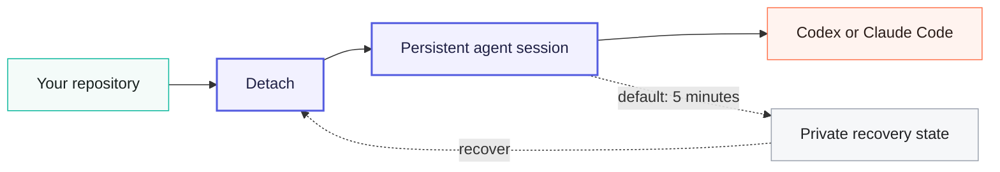

<p align="center">
  
</p>

<h1 align="center">Detach</h1>

<p align="center">
  <strong>Let coding agents outlive the Terminal.</strong><br>
  A ready-to-use macOS app for reliable, long-running Codex and Claude Code sessions.
</p>

<p align="center">
  <a href="https://github.com/iltsarev/detach/releases/latest"></a>
  
  
  
</p>

<p align="center">
  <a href="https://github.com/iltsarev/detach/releases/latest"><strong>Get Detach for macOS →</strong></a>
  &nbsp;·&nbsp;
  <a href="#quick-start">Quick start</a>
  &nbsp;·&nbsp;
  <a href="#use-the-app">App tour</a>
  &nbsp;·&nbsp;
  <a href="#recovery-without-surprises">Recovery</a>
</p>

---

Coding agents can work for hours. A Terminal window—or the Mac underneath
it—is not always that patient.

Detach runs Codex or Claude Code inside a managed, persistent tmux task. It
checkpoints provider session state on a five-minute cadence by default, keeps
useful logs after the process exits, and puts the whole session lifecycle in a
native Mac app. A bundled CLI is there when you want it.

Close Terminal and attach later. Run without a window. Recover after an abrupt
shutdown. Keep the session alive with the lid closed through the required
Amphetamine integration.

Download the DMG, move Detach.app to Applications, and open it. Guided setup
installs the bundled CLI, checks everything Detach needs, and helps resolve
anything missing.

## Why Detach

<table>
  <tr>
    <td width="50%"><strong>Outlive Terminal</strong><br>Closing a window detaches the client; the agent keeps working in tmux.</td>
    <td width="50%"><strong>Recover after interruption</strong><br>Provider-aware checkpoints run on a five-minute cadence by default.</td>
  </tr>
  <tr>
    <td width="50%"><strong>One interface, two agents</strong><br>Codex and Claude Code share the same session lifecycle.</td>
    <td width="50%"><strong>See everything at a glance</strong><br>The app shows status, context usage, logs, and the actions available now.</td>
  </tr>
  <tr>
    <td width="50%"><strong>Ready as a Mac app</strong><br>Guided setup, dependency checks, CLI repair, updates, and session controls come in one download.</td>
    <td width="50%"><strong>Work with the lid closed</strong><br>Required Amphetamine + Power Protect integration safely shares one Closed-Display session.</td>
  </tr>
</table>

## Quick start

1. Download the current **DMG** from
   [GitHub Releases](https://github.com/iltsarev/detach/releases/latest), move
   **Detach.app** to `/Applications`, and open it.
2. Follow the guided setup. Detach requires
   [Amphetamine](https://apps.apple.com/app/amphetamine/id937984704) and
   [Amphetamine Power Protect](https://x74353.github.io/Amphetamine-Power-Protect/),
   checks them separately, and opens each official installer when needed.
3. If needed, install and sign in to [Codex CLI](https://github.com/openai/codex)
   or [Claude Code](https://docs.anthropic.com/en/docs/claude-code/overview),
   then return to Detach.
4. Choose **＋**, select a project and provider, and start the session.

Or start from your own Terminal after setup:

```bash
cd ~/my/repo
detach codex
# or
detach claude
```

Detach finds compatible terminal apps already installed on your Mac. Choose
one in Settings; start, attach, resume, and recover open there. The main app
does not need Terminal Automation access. Settings also offers optional
notifications when an agent finishes a turn and waits for you, or when a
session finishes, fails, or becomes recoverable. Text size is an exact 11–22 pt
setting (14 pt by default). Keep-awake is part of the standard setup: Detach
starts it automatically for active sessions, and macOS may ask once for
permission to control Amphetamine and run the background helper.

## Use the app

- **Start:** choose **＋**, a project, Codex or Claude Code, and an optional
  opening prompt.
- **Watch:** see every session in one sidebar with live status—including when
  an agent is waiting for you—plus model, context usage, checkpoint time, and
  ANSI-aware log previews.
- **Return:** open a live session in your selected terminal, resume a saved
  conversation, or recover the last successful checkpoint after an interruption.
- **Control:** stop or delete sessions, repair the CLI, manage updates, and
  inspect the required closed-lid components from one place.

Detach.app does not need to stay open. The managed agent session continues in
tmux, and the dashboard catches up when you come back.

<details>
<summary><strong>Prefer the Terminal? Use the bundled CLI</strong></summary>

The app installs `detach` automatically. Start interactively, start with a
prompt, or leave the session running in the background immediately:

```bash
detach codex
detach codex -- "implement the queued task"
detach claude --detach -- "run the test suite and fix failures"
```

Name a session when you want something more memorable than the project-derived
default:

```bash
detach claude --name migration
detach claude attach migration
detach claude logs migration
detach claude stop migration
```

List every Detach-managed session across both providers, then resume by the
provider session UUID:

```bash
detach list
detach resume SESSION_UUID
detach resume --name migration --detach SESSION_UUID
```

| Command | What it does |
|---|---|
| `detach <provider> [start]` | Start a fresh session for the current project directory (Git root when available). |
| `detach <provider> attach [name]` | Attach to a session that is still running. |
| `detach list [--json]` | List Codex and Claude sessions together; JSON mode emits JSONL. |
| `detach resume <uuid>` | Detect the provider and project, then continue that provider session. |
| `detach <provider> status [name]` | Show worker, provider, checkpoint, and keep-awake state. |
| `detach <provider> logs [name]` | Read the retained tmux pane without attaching. |
| `detach <provider> stop [name]` | Stop a running managed session. |
| `detach <provider> recover [name]` | Run checkpoint recovery and resume after an interruption. |
| `detach <provider> delete [name]` | Delete stopped Detach state; leave provider stores untouched. |
| `detach doctor` | Check the installation, dependencies, providers, Amphetamine, Power Protect, and the background service. |

A normal start always creates a new Codex or Claude session. Use `attach` for a
live session and `resume` for an existing provider session. Detach allows one
live managed agent per canonical project root across both providers, so two
agents cannot race over the same worktree by accident.

Closing Terminal only detaches its tmux client. Press `Ctrl-b d` to detach
without closing the window.

</details>

## How it works



You start and monitor the session in Detach.app. The app can close while the
agent keeps running in tmux. In parallel, Detach records local, provider-aware
checkpoints so an unexpected restart does not have to mean a lost conversation.

## Recovery without surprises

There are three deliberately different ways to return to work:

| Situation | Action | Result |
|---|---|---|
| The agent is still running | **Attach** | Reopen the live Terminal session. |
| The provider conversation already exists | **Resume** | Continue it normally by session UUID. |
| The Mac or provider state was interrupted | **Recover** | Restore Detach's last successful checkpoint, then resume. |

Recovery is an explicit rollback of the provider conversation. It requires at
least one successful transcript checkpoint, and the saved point may be older
than the five-minute cadence if a snapshot could not complete. Normal resume
leaves live provider state alone; explicit recovery may replace it with the
saved checkpoint.

Checkpoints protect the agent conversation, not repository contents. Detach
captures Git worktree status for diagnosis but never rolls project files back.

<details>
<summary><strong>Technical recovery details</strong></summary>

On each successful checkpoint, Detach stores common metadata, pane output, Git
worktree status, and provider-specific recovery state:

- **Codex:** the session UUID, rollout JSONL, and a consistent SQLite backup;
- **Claude Code:** the preassigned session UUID, transcript JSONL, project
  companion data, file history, tasks, and session environment.

Restore paths and contents are validated before Detach writes into provider
storage. The Codex SQLite copy remains an emergency artifact and is never
restored over Codex's shared database automatically.

Change the interval for special cases:

```bash
DETACH_CODEX_CHECKPOINT_INTERVAL=600 detach codex
DETACH_CLAUDE_CHECKPOINT_INTERVAL=600 detach claude
```

Checkpoint directories contain full conversation data and use private file
permissions:

```text
~/.local/state/detach/codex/sessions/
~/.local/state/detach/claude/sessions/
```

`delete` and uninstall remove only Detach-owned state. They do not remove
transcripts from `~/.codex` or `~/.claude`.

</details>

## Required keep-awake setup

Detach requires [Amphetamine](https://apps.apple.com/app/amphetamine/id937984704)
and its official
[Power Protect component](https://x74353.github.io/Amphetamine-Power-Protect/).
Guided setup stays open until both are installed and the Detach background
service is enabled. There is no keep-awake toggle: every managed session uses
the integration automatically, while tmux and checkpoints continue to protect
the agent lifecycle independently.

> [!CAUTION]
> Closed-lid sessions may cool less effectively during sustained CPU load, and
> excess heat is easier to miss. Keep the Mac on a hard, flat, well-ventilated
> surface—never on bedding, in a sleeve, or inside a bag—and keep every vent
> clear. Check it periodically; open the lid or stop the session if it becomes
> unusually hot or shows a temperature warning. See
> [Apple's temperature guidance](https://support.apple.com/en-us/102336).

<details>
<summary><strong>How keep-awake coordination stays safe</strong></summary>

The first live session starts one infinite Closed-Display session; additional
sessions share it. The last session ends it only if Detach created it and
its observable properties have not changed. A compatible session you started
yourself is borrowed, never replaced or ended.

The required per-user helper reconciles stale leases after crashes and at
login. If Amphetamine's own low-battery auto-end setting is enabled, Detach
honors its configured threshold and will not start a new closed-lid task at or
below it. Detach warns when that protection is disabled; it does not change the
setting for you.

Do not replace the Amphetamine session manually while Detach sessions are
running. Closed-lid coordination is currently single-user; multiple
simultaneously logged-in users are not supported.

</details>

<details>
<summary><strong>Provider policy and owned flags</strong></summary>

### Codex

On an unmanaged Mac, Detach defaults to:

```text
--ask-for-approval never --sandbox workspace-write --no-alt-screen
```

This lets the agent work autonomously inside the repository without granting
unrestricted system access. Explicit Codex approval and sandbox arguments
override the defaults. When managed requirements disallow `never`, Detach
inherits the configured managed approval policy and reviewer instead. Detach
owns `-C/--cd`; start it from the target project.

### Claude Code

Detach defaults to `--permission-mode auto` unless you pass an explicit mode.
It never enables `--dangerously-skip-permissions`. Detach owns provider session
and background flags such as `--session-id`, `--resume`, and `--background` so
checkpoint identity and tmux lifetime stay deterministic. Provider flags that
collide with Detach flags, such as Claude's own `--name`, belong after `--`.

Both providers run without the alternate screen so retained logs and pane
checkpoints stay readable.

</details>

<details>
<summary><strong>Repair or remove Detach</strong></summary>

Normal installation, updates, repair, and removal are available in Detach.app.
If you are troubleshooting from Terminal, check or repair the installed CLI:

```bash
detach doctor
detach repair
detach uninstall --keep-state
```

Prefer uninstalling from Detach Settings so macOS can unregister the required
background helper before removing the CLI. Keeping state preserves recovery
checkpoints for a future reinstall.

To remove Detach checkpoints as well:

```bash
detach uninstall --purge-state
```

This requires an explicit request and still leaves provider stores,
Amphetamine Power Protect, and system configuration alone. Uninstall refuses
to run while a managed session is alive.

</details>

## Requirements

| Component | Required for |
|---|---|
| A Mac | macOS 14 or newer; Apple silicon and Intel are supported |
| Codex CLI or Claude Code | At least one installed and authenticated provider; setup points you to the official installer |
| `tmux` and `jq` | Checked during guided setup, with a ready next step if either is missing |
| Amphetamine + Power Protect | Required keep-awake and Closed-Display Mode integration |

---

<p align="center">
  <sub>Built for the moments when “just keep this Terminal open” is not good enough.</sub>
</p>
