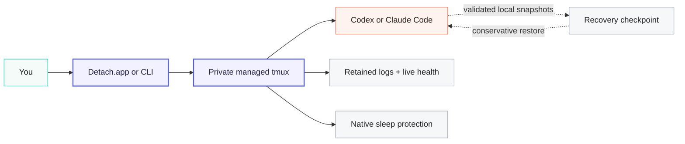

<p align="center">
  
</p>

<h1 align="center">Detach</h1>

<p align="center">
  <strong>Close the terminal. Keep the agent running.</strong><br>
  A native macOS control center and reliability layer for long-running Codex and Claude Code sessions.
</p>

<p align="center">
  <a href="https://github.com/iltsarev/detach/releases/latest"></a>
  
  
  
  
</p>

## Install Detach

> [!IMPORTANT]
> Detach is a Mac app. Install it from the DMG in Finder—do not give this
> repository link to Codex or Claude Code and ask the agent to install it.

1. [**Download Detach.dmg**](https://github.com/iltsarev/detach/releases/latest/download/Detach.dmg).
2. Open the DMG and drag **Detach.app** to **Applications**.
3. Open **Detach** and follow the guided setup.

That is the entire Detach installation. The setup assistant installs the
bundled `detach` CLI, checks every component, and walks you through the one-time
macOS approvals for its background monitor and sleep-protection helper.
After the bundled runtime is verified, pending approval is shown as its own
actionable step rather than as an installation failure. Setup completes only
after the signed helper is reachable and the background monitor reports.

Detach manages Codex CLI and Claude Code; it does not replace them. You need at
least one provider installed and authenticated before starting a session. The
assistant detects both providers and explains what is missing without mixing
their installation with the Detach installation above.

<p align="center">
  
</p>

## Why Detach

AI agents are good at work that takes longer than a terminal window should have
to stay open: refactors, migrations, test-and-fix loops, repository audits, and
large code generation. Detach gives those runs a durable home.

- **Leave without killing the run.** Close Terminal, close the Detach window,
  or detach from tmux. The managed agent keeps running independently.
- **See every agent in one place.** Codex and Claude Code share one native
  dashboard with live state, logs, model, context usage, checkpoint time, and
  clear next actions.
- **Come back the right way.** Attach to the process that is still alive,
  resume an existing provider conversation, or recover an interrupted managed
  run from a validated local checkpoint.
- **Let the Mac keep working.** Native sleep protection can keep a run active
  with the lid closed, reports its real state, and releases protection at low
  battery.
- **Know when something actually broke.** Detach verifies tmux ownership,
  worker and provider identity, run tokens, heartbeats, metadata, and
  checkpoints. A long provider turn is not mislabeled as hung just because it
  is quiet.
- **Keep control of local data.** Checkpoints and retained logs stay on your
  Mac. Storage usage is visible, and cleanup is limited to state Detach can
  prove is safe to remove.

Detach is not another chat client. It is the process, recovery, power, and
operations layer around the provider terminal experience you already use.

## The everyday workflow

1. Click **＋** in Detach, choose a project and provider, and optionally add the
   first prompt.
2. Let the agent work in your preferred terminal.
3. Close the terminal or Detach.app whenever you want.
4. Reopen Detach to inspect progress, read logs, answer the agent, stop the run,
   or recover it after an interruption.

Prefer the shell? Guided setup adds `detach` to your login and interactive
shell. Open a new terminal window and run:

```bash
cd ~/my/repo
detach codex -- "implement the queued task"

# Or use Claude Code and return immediately to your shell:
detach claude --detach -- "run the test suite and fix failures"
```

The app and CLI operate on the same sessions. Start in one and continue in the
other.

## One command center for Codex and Claude Code

Detach.app owns the session lifecycle while interactive work stays in a real
terminal. It detects Terminal, iTerm2, Warp, and apps that register as
shell-script runners; Settings can point to another terminal manually.

The dashboard gives every managed session:

- live working, waiting, completed, failed, hung, recoverable, orphaned, and
  stopped state;
- an explicit health reason when the runtime needs attention;
- provider, project, model, context use, checkpoint time, and exit status;
- ANSI-aware retained logs with color and common text attributes;
- safe actions chosen from **Attach**, **Stop**, **Resume**, **Recover**, and
  **Delete** according to the proven state;
- optional notifications when a turn is ready for an answer, a session
  finishes or fails, or recovery becomes available;
- a stable identity color shared by the sidebar and that session's tmux status
  bar.

Sessions waiting for your reply move into **Answer ready**, ahead of agents
that are still working. That signal comes from structured provider lifecycle
records, not guesses based on terminal text. Mid-turn permission prompts are
not currently part of that signal.

The optional menu bar companion shows whether the Mac can sleep, how fresh the
background health report is, how many protected sessions are live, and which
sessions are waiting for an answer. Closing the main window keeps the menu bar
and background checks available; quitting Detach.app does not kill managed
sessions.

## Built to survive the ordinary interruptions



Every agent runs under a Detach-owned Apple Silicon tmux runtime on a private,
absolute socket. Closing a client does not kill the worker. The tmux server is
anchored in persistent Detach state rather than in the first project directory,
so unmounting one project does not poison unrelated sessions.

Once provider identity is known, Detach attempts an initial conversation
checkpoint, repeats every five minutes by default, and attempts a final
checkpoint when the worker exits. It also retains terminal output and records
canonical repository context without invoking Git or Apple's Command Line
Tools shim.

The app window is not the runtime. A session, its power lease, and its
checkpoint loop continue independently; the dashboard catches up when it is
opened again.

## Health that distinguishes slow from broken

Detach evaluates health from several independent facts instead of one timeout:

- the expected tmux server, managed session, and retained pane;
- the Detach ownership marker and matching per-run token;
- the exact worker PID and provider PID, their user ownership, and their
  process relationship;
- valid session metadata and provider conversation identity;
- worker heartbeat and checkpoint freshness;
- whether the latest checkpoint is valid enough for conservative recovery.

This produces useful states rather than a generic red light:

| State | Meaning | Safe actions |
|---|---|---|
| **Running** | The managed pane, worker, provider, and run token agree. | Attach, Stop |
| **Hung** | A required runtime identity is missing or inconsistent, or a recorded process survived tmux. | Attach/Stop only when tmux ownership is still proven; otherwise no mutation |
| **Recoverable** | The live runtime is gone and a matching validated checkpoint exists. | Recover, Delete |
| **Orphaned** | The live runtime is gone and no safe recovery checkpoint exists. | Delete |
| **Finished / stopped** | The worker reached a terminal state. | Resume or Delete, depending on provider identity |
| **Collision / corrupt** | tmux ownership or metadata cannot be trusted. | Conservative, state-specific actions only |

A stale heartbeat or old checkpoint is diagnostic information, not proof that
the provider is hung. If the owned worker and provider are alive, Detach keeps
the session running even through an arbitrarily long provider turn.

If tmux disappears while a recorded process is still alive, Detach does not
guess which signal is safe. It blocks Stop, Recover, Delete, and bulk cleanup
until that exact runtime is gone. Foreign processes and unmanaged tmux sessions
are never signaled or removed. Concurrent Stop, Recover, and Delete requests
are serialized per session and recheck ownership immediately before mutation.

For automation and diagnosis:

```bash
detach list --json
detach reconcile --dry-run --json
detach cleanup --dry-run --json
```

The reconcile preview reports only declarative repairs supported by current
evidence, such as removing a dead managed pane and marking a session
recoverable or orphaned. The cleanup preview includes only stopped or orphaned
sessions that pass the storage and ownership checks.

## Attach, Resume, and Recover are different on purpose

| Situation | Action | What Detach does |
|---|---|---|
| The managed worker is still alive | **Attach** | Reopens the existing tmux session without starting another agent. |
| The provider conversation exists | **Resume** | Continues the conversation by UUID after detecting its provider and saved project. |
| A Detach-managed run was interrupted | **Recover** | Validates the saved context and checkpoint, then restarts the exact conversation under management. |

In short: **Attach = live process**, **Resume = provider conversation**,
**Recover = interrupted managed run**.

Recovery validates identity, paths, and provider data before it writes. It
never rolls repository files back. A shared project lock also prevents two
Detach-managed agents—even from different providers—from writing the same
worktree at once.

<details>
<summary><strong>Provider-specific checkpoint and recovery rules</strong></summary>

- **Codex:** Detach saves the session UUID and rollout JSONL. It preserves a
  valid live rollout when that file is at least as large as the checkpoint and
  restores only when the matching live rollout is missing, invalid, or
  smaller. A separately validated SQLite backup is an emergency artifact and
  is never restored over Codex's shared database automatically.
- **Claude Code:** Detach saves the preassigned session UUID, transcript,
  project companion data, file history, session environment, tasks, and
  matching team data in an atomic archive. Explicit recovery restores a valid,
  matching checkpoint and its companion artifacts before resume.
- **Both:** unsafe paths, ambiguous or mismatched UUIDs, malformed JSONL, and
  invalid checkpoint contents are rejected.

Checkpoint state lives here:

```text
~/.local/state/detach/codex/sessions/
~/.local/state/detach/claude/sessions/
```

Change the default interval for a special run:

```bash
DETACH_CODEX_CHECKPOINT_INTERVAL=600 detach codex
DETACH_CLAUDE_CHECKPOINT_INTERVAL=600 detach claude
```

</details>

## See exactly what Detach stores

Settings → System shows total Detach disk use, checkpoint/log breakdowns, and
the largest sessions. You can select safe sessions, preview the exact allocated
size and contents, delete every safely removable session, or open the state
directory in Finder.

Cleanup is deliberately narrow:

- only fully measured `stopped` or `orphaned` sessions are eligible;
- live, recoverable, corrupt, foreign, or ownership-ambiguous state is not;
- provider storage under `~/.codex` and `~/.claude` is excluded;
- symlinks are measured as links and never followed;
- sparse files, hard links, unreadable entries, and partial deletion are
  handled conservatively;
- the exact preview is rechecked under the session/checkpoint locks before a
  destructive action.

The same data is available to scripts:

```bash
detach storage --json
detach storage cleanup --dry-run --json
detach storage cleanup --dry-run --json --session detach-codex-my-project
```

Deleting Detach state does not delete provider transcripts or conversations.

## Close the lid without abandoning the run

Keep-awake protection starts automatically for each managed session. An
unprivileged wrapper holds the normal IOKit idle-sleep assertion while a
narrowly scoped signed helper manages closed-lid protection. The provider is
started only after both protections are confirmed.

The app, menu bar, CLI, and tmux status bar expose the same text-first state:
**Mac stays awake**, **Mac can sleep**, **Low battery**, or an honest unknown
state when the helper or health report cannot be trusted.

When the lid closes during a protected run, Detach asks macOS to turn the
display off through the normal Lock Screen path. Reopening the lid returns to
Touch ID, Apple Watch, or password authentication according to your existing
macOS settings; Detach does not weaken the lock policy.

At 10% battery or below on battery power, Detach releases its sleep assertions
and reports **Mac can sleep: low battery**. It will not trade the machine's last
battery reserve for a hidden promise that the run is protected.

> [!CAUTION]
> Sustained closed-lid work can hide excess heat. Keep the Mac on a hard, flat,
> well-ventilated surface—never in a sleeve, bag, or on bedding. Open the lid or
> stop the session if the Mac becomes unusually hot or reports a temperature
> warning. See [Apple's temperature guidance](https://support.apple.com/en-us/102336).

<details>
<summary><strong>How the power safety boundary works</strong></summary>

Each live session has a renewable root-helper lease. The runtime renews it
every 30 seconds; a lease expires after 120 seconds without a heartbeat. The
last live lease restores normal closed-lid sleep. An orderly stop releases the
lease immediately, while the TTL bounds stale protection after an uncatchable
crash or `SIGKILL`.

Ownership is persisted before power changes. If closed-lid protection was
already active, Detach borrows it and never disables it. If Detach enabled the
setting, it restores it after the last lease, a stale lease, or orderly helper
shutdown. Previous-boot leases are discarded using the macOS boot-session UUID.

The helper accepts only signed Detach power-client requests from the same Team
ID and the current non-root console user. It exposes status and lease
operations only; it cannot execute providers or arbitrary root commands.

Closed-lid protection uses `/usr/bin/pmset -a disablesleep`, an undocumented
macOS interface. Every production release therefore requires a signed
real-power smoke test and a supervised physical lid test on Apple Silicon.

</details>

## A first-class CLI

```bash
# Start
detach codex
detach codex --detach -- "run the migration"
detach claude --name review -- "review the repository"

# Monitor and return
detach list
detach list --json
detach claude attach review
detach resume SESSION_UUID

# Diagnose and maintain
detach doctor
detach storage --json
detach reconcile --dry-run --json
```

| Command | What it does |
|---|---|
| `detach <provider> [start]` | Start a fresh conversation for the current project. |
| `detach <provider> attach [name]` | Attach to a live managed session. |
| `detach list [--json]` | List Codex and Claude sessions together; JSON mode emits JSONL. |
| `detach resume <uuid>` | Detect provider and project, then continue that conversation. |
| `detach <provider> status [name]` | Show runtime, checkpoint, and power state. |
| `detach <provider> logs [--ansi] [name]` | Read retained output without attaching. |
| `detach <provider> stop [name]` | Stop a live session only when its managed runtime is proven. |
| `detach <provider> recover [name]` | Restart an interrupted run from validated saved context. |
| `detach <provider> delete [--force] [name]` | Delete eligible Detach state; leave provider storage untouched. |
| `detach storage --json` | Report logical and allocated storage by session and data type. |
| `detach storage cleanup --dry-run --json [--session name]` | Preview an exact safe cleanup selection. |
| `detach reconcile --dry-run --json` | Preview safe stale-state and dead-runtime reconciliation. |
| `detach cleanup --dry-run --json` | Preview bulk cleanup of stopped/orphaned sessions. |
| `detach power status --json` | Read combined idle-sleep and closed-lid protection. |
| `detach config tmux-style [detach\|inherit]` | Use Detach's session identity bar or your tmux theme. |
| `detach config tmux-mouse [on\|off]` | Toggle one-line scrolling and clipboard copy bindings. |
| `detach doctor [--json]` | Verify the app-installed runtime, provider CLIs, helper, and monitor. |
| `detach repair` | Reinstall the pristine immutable CLI payload from Detach.app. |
| `detach uninstall [--keep-state\|--purge-state]` | Remove Detach components and choose whether checkpoints stay. |

Name a session when the project-derived default is not memorable. Press
`Ctrl-b d` to detach a terminal client without closing its window.

## Terminal details that make parallel work readable

Every managed session receives a deterministic color based on provider and
project. The app uses it in the sidebar; the tmux bar uses the same tint with
provider, project, state, and power labels. Completed sessions fade and failed
sessions turn red. All styling is session-local: Detach never edits the user's
global tmux config.

Inside managed tmux, the mouse wheel scrolls one line at a time and mouse
selection copies to the macOS clipboard. Use `detach config tmux-mouse off` to
return mouse handling to the terminal emulator. In Terminal.app, Option-drag
also bypasses tmux selection.

Choose **My tmux theme** in Settings → Terminal, or run
`detach config tmux-style inherit`, to remove Detach's bar overrides.

## Privacy and security defaults

- Checkpoints, metadata, and retained logs stay local with private file
  permissions. Detach has no account or hosted session backend.
- Codex and Claude Code continue to use their normal services and local
  provider storage.
- Immutable CLI payloads are activated atomically, so an update does not
  rewrite bytes used by sessions that are already running.
- A managed project lock prevents accidental concurrent writers in one
  worktree.
- tmux ownership and run tokens are checked before Attach, Stop, Recover, or
  Delete; foreign sessions are left untouched.
- Cleanup never follows symlinks into another tree and never treats provider
  storage as Detach-owned state.

<details>
<summary><strong>Default provider flags</strong></summary>

### Codex

On an unmanaged Mac, Detach defaults to:

```text
--ask-for-approval never --sandbox workspace-write --no-alt-screen
```

Explicit approval and sandbox arguments override these defaults. If managed
requirements disallow `never`, Detach inherits the managed approval policy and
reviewer. Detach owns `-C/--cd`; start it from the target project.

### Claude Code

Detach defaults to `--permission-mode auto` unless an explicit mode is passed.
It never adds `--dangerously-skip-permissions`. Detach owns provider session
and background flags so checkpoint identity and tmux lifetime remain
deterministic. Provider flags that collide with Detach flags belong after `--`.

Both providers run without the alternate screen so retained output remains
readable.

</details>

## Self-contained Mac product

Detach includes:

| Component | Included behavior |
|---|---|
| Native app | Dashboard, settings, notifications, menu bar companion, setup, repair, and uninstall. |
| Private tmux | Bundled Apple Silicon runtime; no separate tmux install or global config changes. |
| Typed state runtime | Reads and updates Detach JSON/JSONL without a `jq` dependency. |
| Native power components | Idle-sleep assertion, signed closed-lid helper, and background health monitor. |
| Updates | Signed Sparkle updater embedded in Detach.app. |
| CLI | App-installed `detach` command that controls the same sessions as the dashboard. |

You do not need Homebrew, a separate tmux or JSON tool, Amphetamine, Power
Protect, `caffeinate`, or another keep-awake package.

## Requirements and honest boundaries

| Component | Requirement |
|---|---|
| Mac | macOS 14 or newer on Apple Silicon (`arm64`); Intel Macs are not supported. |
| Provider | At least one authenticated [Codex CLI](https://github.com/openai/codex) or [Claude Code](https://docs.anthropic.com/en/docs/claude-code/overview). |
| macOS approval | An administrator password is required once to register the signed power helper; Login Items approval may also be required. |

Detach keeps a live process running while the current macOS user session and
Mac are running. Live sessions do not survive logout or reboot. Intentionally
killing the provider, worker, or private tmux server ends the live run; the
last valid checkpoint may still offer Resume or Recover.

Checkpoints protect provider conversation state, not repository files. Detach
does not roll source code back and does not replace version control or backups.

## Repair, update, or uninstall

Updates are handled in Detach.app. Settings also exposes installation health,
CLI repair, helper status, and removal of Detach-owned components.

From a terminal:

```bash
detach doctor
detach repair
detach uninstall --keep-state
detach uninstall --purge-state
```

`--keep-state` preserves recovery checkpoints for a future reinstall.
`--purge-state` removes Detach state but still leaves `~/.codex` and
`~/.claude` alone. Uninstall refuses to proceed while a managed session is
alive; Detach.app itself remains until it is moved to Trash.

## Give the next long run a durable home

[**Download Detach.dmg →**](https://github.com/iltsarev/detach/releases/latest/download/Detach.dmg)
&nbsp;·&nbsp;
[Report an issue](https://github.com/iltsarev/detach/issues)
