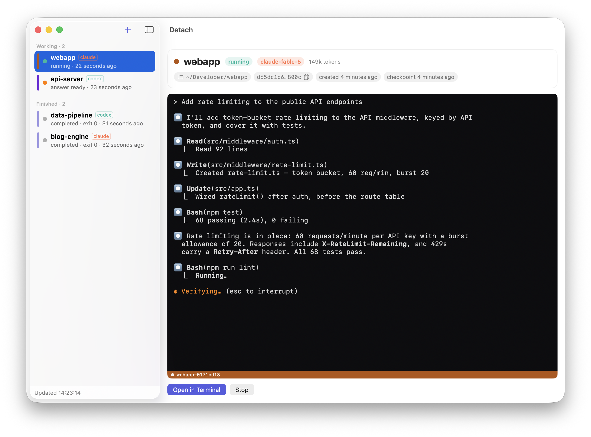
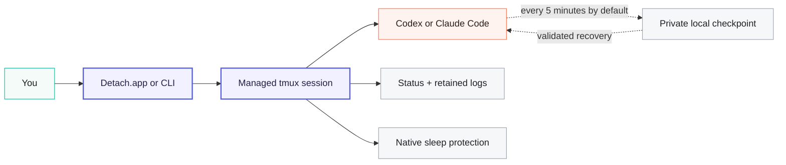

<p align="center">
  
</p>

<h1 align="center">Detach</h1>

<p align="center">
  <strong>Close the terminal. Keep the agent running.</strong><br>
  The macOS reliability layer for long-running Codex and Claude Code sessions.
</p>

<p align="center">
  Leave, monitor, and recover agent sessions from one native app—with private,
  local recovery checkpoints every five minutes by default.
</p>

<p align="center">
  <a href="https://github.com/iltsarev/detach/releases/latest"></a>
  
  
  
</p>

<p align="center">
  <a href="https://github.com/iltsarev/detach/releases/latest/download/Detach.dmg">
    
  </a>
</p>

<p align="center">
  <a href="#quick-start">Quick start</a>
  &nbsp;·&nbsp;
  <a href="#attach-resume-or-recover">How recovery works</a>
  &nbsp;·&nbsp;
  <a href="#prefer-the-terminal-the-cli-is-first-class">CLI</a>
</p>

<p align="center">
  <sub>Apple Silicon · Native app + CLI · No Homebrew runtime dependencies · Recovery state stays on your Mac</sub>
</p>

<p align="center">
  
</p>

---

## Long agent runs without terminal babysitting

Long refactors, migrations, and test-and-fix loops are useful only if you can
leave them. Detach turns Codex or Claude Code runs launched through it into
managed sessions with a stable home and a clear way back.

- **Leave it running.** Close the terminal window or quit Detach.app. The live
  process continues in Detach's bundled tmux while the user session and Mac are
  running. Native sleep protection can keep it going with the lid closed.
- **Know when to come back.** See what is running, waiting for your next
  message, finished, failed, or recoverable. Inspect logs, model, context use,
  and the latest checkpoint; optionally get notified when a turn completes or
  a session finishes, fails, or becomes recoverable.
- **Return without guessing.** Attach to the live process, resume an existing
  provider conversation, or recover an interrupted managed run with explicit,
  provider-specific safeguards.
- **Use one workflow for both agents.** Codex and Claude Code share the same
  dashboard, session list, controls, project protection, and one UUID-based
  resume command.

> tmux keeps the process alive while the Mac is running. Detach adds a recovery
> layer for the conversation: it tracks provider identity, saves validated
> local checkpoints, retains logs, coordinates keep-awake, and applies
> explicit recovery rules.

Detach ships as a Mac product, not a setup recipe: the app includes its CLI,
Apple Silicon tmux runtime, typed state helper, native sleep-protection components,
Sparkle updater, guided setup, repair, and background monitoring. You keep
working in the provider and terminal you already use. Codex and Claude Code are
deliberately not bundled: install and authenticate either provider yourself
using its official instructions.

Detach.app is available in English and Russian and follows the language chosen
for Detach in macOS.

## What's new in 0.2.1

Detach 0.2.1 is the first published self-contained release:

- The app bundles its own Apple Silicon tmux, typed state runtime, native power
  client and helpers, background monitor, and Sparkle updater. Homebrew,
  Amphetamine, Power Protect, `caffeinate`, a separate tmux, and `jq` are no
  longer runtime requirements.
- A guided assistant installs and verifies the immutable CLI payload, walks
  through the macOS approvals, detects Codex CLI and Claude Code, and does not
  unlock the dashboard until the background monitor has produced a fresh
  health report.
- An optional menu bar companion uses the Detach prompt mark to show the
  effective sleep state by shape, adds the live session count while protection
  is active, and summarizes state, reason, and report freshness on one line.
  Its menu prioritizes sessions waiting for an answer and reopens the selected
  session in the dashboard.
- Native keep-awake coordination protects both idle sleep and closed-lid runs,
  releases Detach-owned protection at 10% battery, and exposes one consistent
  status in the app, menu bar, and tmux.
- Closing the lid during a protected run now turns the displays off through
  macOS's normal Lock Screen path. The provider remains active, while reopening
  the lid returns to Touch ID, Apple Watch, or password authentication according
  to the user's Lock Screen settings.
- Managed terminals now get identity-tinted tmux status bars, one-line wheel
  scrolling and clipboard copy, while dashboard previews preserve terminal
  colors plus bold, dim, italic, underline, strikethrough, and reverse video.
- Once setup has completed, later launches show the dashboard immediately.
  Startup and app-activation health refreshes run in the background without
  flashing the onboarding assistant; a confirmed setup problem still surfaces
  with an explicit repair path.
- The one-time setup assistant uses larger, scalable hero artwork and typography
  so its approvals and next actions remain clear at every supported text size.

## Quick start

> [!IMPORTANT]
> Before the first run, install and authenticate Codex CLI or Claude Code.
> Guided setup checks the provider and every Detach-owned component. Provider
> authentication remains in Codex or Claude Code itself.

1. Download the **Detach 0.2.1 DMG** from the
   [Releases page](https://github.com/iltsarev/detach/releases), move
   **Detach.app** to `/Applications`, and open it.
2. Follow the setup assistant. Detach installs its bundled command-line
   runtime automatically, then asks once for the macOS approvals: enable
   Detach in the Login Items list that opens — macOS may show one or two
   switches, and the sleep-protection helper needs an administrator password.
   The assistant checks progress on its own and advances as each step
   completes. **Open Dashboard** becomes available only after the background
   monitor sends its first fresh health report. If that takes longer than 90
   seconds, use **Retry Background Monitor** on the same card.
3. If neither [Codex CLI](https://github.com/openai/codex) nor
   [Claude Code](https://docs.anthropic.com/en/docs/claude-code/overview) is
   installed yet, the assistant can run the official installer in your own
   terminal, or open the official instructions; Detach detects the new CLI
   automatically. Authenticate through the provider's normal flow before the
   first run.
4. Choose **＋**, select a project and provider, add an optional opening prompt,
   and start the session.

When the session appears as running in the sidebar, you are done. Close the
terminal window or Detach.app and the tmux server, provider process, power
wrapper, and checkpoints continue; reopen Detach whenever you want the
dashboard back. This lifetime does not cross logout or reboot, and intentionally
killing the managed tmux server or provider ends the live run. The last valid
checkpoint remains available for Resume or Recover.

Prefer to start from a shell? Guided setup also adds `detach` to your login and
interactive shell. Open a new terminal window, then run:

```bash
cd ~/my/repo
detach codex
# or
detach claude
```

## One command center for every session

Detach.app is the control plane for your agents, not another embedded chat UI.
Interactive work opens in a terminal you choose: Detach detects installed
terminals automatically (Terminal, iTerm2, Warp, and any app that registers
itself as a shell-script runner), and Settings can point to any other terminal
app manually. The app gives the entire lifecycle of every managed session one
clear home:

- **Start:** choose a project, Codex or Claude Code, and an optional first
  prompt.
- **Monitor:** see both providers in one sidebar with live status, model and
  context usage when available, checkpoint time, and ANSI-aware log previews
  that preserve colors, emphasis, checklist strikethrough, and reverse-video
  highlights. Sessions waiting for your reply move into **Answer ready**, above
  agents that are still working.
- **Know:** opt in to notifications when a completed turn is waiting for your
  next message, or when a session finishes, fails, or becomes recoverable.
- **Glance:** the optional menu bar icon answers the sleep question without
  opening the app. The Detach prompt mark has a filled dot while the Mac is
  being held awake, dims when it can sleep, gains an exclamation mark when
  protection needs attention, and becomes an outline when the report is
  unknown or stale. Its first menu line combines the effective state, the
  reason, and report freshness; live sessions waiting for a reply come first.
  Closing the main window keeps the icon and background checks alive; ⌘Q quits
  Detach honestly while sessions, checkpoints, and sleep protection continue
  on their own. Configure it in Settings → General → Menu Bar.
- **Rejoin:** open a live session, resume a known provider conversation, or
  recover an interrupted managed run in your selected terminal.
- **Maintain:** inspect setup health, repair the CLI, manage updates, and remove
  Detach-owned components from Settings.

The footer rotates short, optional tips about useful Detach settings. Tips that
refer to a setting open its exact tab; hide the strip for the current launch or
turn it off permanently in Settings → General.

Every managed session gets a stable identity color derived from its provider
and project. The same accent appears beside the session in Detach.app and
tints that session's whole tmux status bar, so several running sessions are
told apart at a glance, alongside `Detach`, provider, project, and state
labels. Sleep state is text-first as well: the app reports **Mac stays
awake** or **Mac can sleep**, while the tmux bar uses readable labels such as
`MAC AWAKE`, `MAC CAN SLEEP`, and `LOW BATTERY`. Icons are secondary and may
change without changing the status contract. Completed sessions fade to a
faint tint of the same hue and failures turn the bar red. The styling is
session-local, so ordinary tmux sessions and global config stay untouched;
pick **My tmux theme** in Settings → Terminal to remove Detach's status bar
overrides entirely.

Inside a managed session the mouse works the way a terminal should: the wheel
scrolls one line at a time, and selecting text with the mouse copies it to the
macOS clipboard. These bindings live only on Detach's private tmux server. Use
`detach config tmux-mouse off` to hand the mouse back to your terminal
emulator (then select text natively; in Terminal.app, `Option`-drag also
bypasses tmux at any time).

The main app window is not the runtime. A managed session and its checkpoint
loop continue independently, and the dashboard catches up when you reopen it.
After onboarding has completed, Detach renders the dashboard on the first frame
of every later launch and keeps it mounted during activation refreshes. It
returns to setup only after a completed health check finds a real repair or
approval requirement.

Turn-ready status is derived from structured provider lifecycle records rather
than terminal-text guesses; mid-turn permission prompts are not covered by
that signal.

## Attach, resume, or recover?

Detach keeps three return paths deliberately separate:

| Situation | Action | What happens |
|---|---|---|
| The managed worker is still alive | **Attach** | Reopen the existing tmux session without starting another agent. |
| The provider conversation already exists | **Resume** | Continue it by UUID; Detach finds the provider and saved project and can repair matching missing or damaged artifacts when a checkpoint safely helps. |
| A Detach-managed run was interrupted | **Recover** | Restart from Detach's saved session context and apply the provider's conservative checkpoint-recovery policy before resuming. |

In short: **Attach = live process**, **Resume = provider conversation**,
**Recover = interrupted managed run**.

Recovery is conservative and provider-specific. It validates session identity,
paths, and contents before deciding whether a matching checkpoint should
repair or replace provider state. The exact policies are documented below.

A saved point can be older than the default five-minute interval if a snapshot
could not complete. Checkpoints protect the agent conversation—not repository
contents. Detach records canonical repository context for diagnosis but never
rolls project files back. To stay self-contained, it identifies a repository
by its nearest real `.git` marker and records that root without invoking Git or
Apple's Command Line Tools shim.

## How Detach keeps a session durable



Each agent runs under a managed tmux worker, so closing a client does not kill
the process. The tmux binary is an arm64 Detach-owned payload, not a user
installation. Once provider identity is available, Detach attempts an initial
checkpoint, repeats every five minutes by default, and attempts a final
checkpoint when the worker exits. It also retains terminal output and session
status after the provider process finishes.

When Detach creates the shared tmux server, it anchors the daemon in persistent
state rather than in the first project that starts it. The server uses one
private absolute socket under Detach's install state, so Finder, Detach.app,
and Terminal reach the same server regardless of `TMUX_TMPDIR`. Every worker
also starts from that stable location and re-enters its canonical project
directory before launching the provider. Unmounting one project can still
interrupt the agent working there, but it does not leave unrelated new Detach
sessions with that project's stale working directory. Remount the project and
use Resume or Recover for the interrupted conversation.

Checkpoints stay on your Mac with private file permissions. Detach has no
separate account or hosted session backend; Codex or Claude Code continues to
use its own normal service and local session storage.

### What you install, and what Detach includes

| Component | Owner | How it works |
|---|---|---|
| Codex CLI and/or Claude Code | You | Install and authenticate at least one provider through its official flow. Detach manages it but does not replace or redistribute it. |
| tmux | Detach | A private Apple Silicon (`arm64`) build is bundled and used for managed sessions. Your own tmux installation and configuration are not required. |
| Structured state handling | Detach | The typed `detach-state` executable reads and updates Detach JSON/JSONL. It replaces the former `jq` runtime dependency. |
| Sleep protection | Detach | The unprivileged `detach-power` wrapper, a signed root helper, and a background monitor replace Amphetamine, Power Protect, and `caffeinate`; protected lid closure also follows the normal macOS Lock Screen path. |
| App updates | Detach | Sparkle remains embedded and signed inside Detach.app; there is nothing separate to install. |

There are no Homebrew runtime dependencies. Detach still uses utilities that
ship with macOS for narrowly scoped platform work, and `doctor` verifies the
complete installed payload before a session starts.

## Recovery with guardrails

- **Provider-aware:** Detach saves the actual conversation format and companion
  state each provider needs, instead of treating every agent as a generic
  terminal process.
- **Validated:** session IDs, JSONL contents, archive paths, and destinations
  are checked before recovery writes into provider storage.
- **Project-safe:** recovery never changes repository files, and a shared
  project lock prevents two Detach-managed agents from racing over the same Git
  worktree—even across different providers.
- **Ownership-safe:** attach, stop, and delete refuse to operate on a tmux
  session Detach does not own.
- **Private by default:** checkpoint metadata, logs, and conversation data are
  local and created with private permissions.
- **Update-safe:** CLI payloads are immutable and activated atomically, so an
  app or CLI update does not rewrite the bytes used by agents already running.

<details>
<summary><strong>Provider recovery policies and checkpoint contents</strong></summary>

Recovery behavior differs where the provider formats differ:

- **Claude Code:** explicit recovery restores a valid matching checkpoint and
  its companion artifacts when one is available, then resumes the conversation.
- **Codex:** recovery preserves a valid live rollout when its file is at least
  as large as the checkpoint. It restores only when the matching live rollout
  is missing, invalid, or smaller.
- **Both:** normal resume may repair missing or damaged matching session data
  before continuing; unsafe paths, mismatched session IDs, and invalid
  checkpoint contents are rejected.

A successful conversation checkpoint publishes metadata and valid provider
session state. Detach also attempts to capture terminal output and canonical
repository context, plus provider-specific supporting state when available:

- **Codex:** session UUID and rollout JSONL. A separate best-effort SQLite
  backup is published only after an integrity check succeeds; it is an
  emergency artifact and is never restored over Codex's shared database
  automatically.
- **Claude Code:** preassigned session UUID, transcript JSONL, project companion
  data, file history, session environment, tasks, and matching team data,
  packed atomically into an archive.

Change the interval for special cases:

```bash
DETACH_CODEX_CHECKPOINT_INTERVAL=600 detach codex
DETACH_CLAUDE_CHECKPOINT_INTERVAL=600 detach claude
```

Checkpoint directories contain full conversation data:

```text
~/.local/state/detach/codex/sessions/
~/.local/state/detach/claude/sessions/
```

`delete` removes the selected Detach session state. Uninstall with
`--keep-state` preserves checkpoints; `--purge-state` removes Detach state.
None of these commands remove transcripts from `~/.codex` or `~/.claude`.

</details>

## Prefer the terminal? The CLI is first-class

The app installs `detach` and configures it for your login and interactive
shell. Start a foreground session, send a first prompt, run immediately in the
background, or return by UUID without remembering which provider or project it
belonged to:

```bash
detach codex
detach codex -- "implement the queued task"
detach claude --detach -- "run the test suite and fix failures"

detach list
detach resume SESSION_UUID
```

<details>
<summary><strong>CLI commands and named sessions</strong></summary>

Name a session when you want something more memorable than the project-derived
default:

```bash
detach claude --name migration
detach claude attach migration
detach claude logs migration
detach claude stop migration
```

List every Detach-managed session across both providers, then resume by UUID:

```bash
detach list
detach resume SESSION_UUID
detach resume --name migration --detach SESSION_UUID
```

| Command | What it does |
|---|---|
| `detach <provider> [start]` | Start a fresh session for the current project (Git root when available). |
| `detach <provider> attach [name]` | Attach to a session that is still running. |
| `detach list [--json]` | List Codex and Claude sessions together; JSON mode emits JSONL. |
| `detach resume <uuid>` | Detect the provider and project, then continue that provider conversation. |
| `detach <provider> status [name]` | Show worker, provider, checkpoint, and keep-awake state. |
| `detach <provider> logs [--ansi] [name]` | Read the retained tmux pane without attaching, optionally preserving ANSI sequences. |
| `detach <provider> stop [name]` | Stop a running managed session. |
| `detach <provider> recover [name]` | Restart an interrupted managed run using its saved recovery context. |
| `detach <provider> delete [--force] [name]` | Delete stopped Detach state; leave provider storage untouched. |
| `detach power status --json` | Read the combined idle-sleep and closed-lid protection state. |
| `detach config tmux-style [mode]` | Select `detach` styling or `inherit` your tmux theme. |
| `detach config tmux-mouse [on\|off]` | Enable or disable Detach's tmux mouse scrolling and copy bindings. |
| `detach doctor [--json]` | Check installation integrity, the bundled tmux/state/power runtime, provider CLIs, native power helper, and background monitor. |
| `detach repair` | Reinstall the pristine immutable payload from the installed app source. |
| `detach uninstall [--keep-state\|--purge-state]` | Remove Detach-owned installed components, optionally preserving or deleting checkpoints. |
| `detach --version` | Print the installed Detach version and build. |

A normal start always creates a new Codex or Claude conversation. Use `attach`
for a live worker and `resume` for an existing provider conversation. Detach
allows one live managed agent per project across both providers, so two agents
cannot race over the same worktree by accident.

Closing the terminal window only detaches its tmux client. Press `Ctrl-b d` to
detach without closing the window.

</details>

## Close the lid without abandoning the run

Keep-awake protection turns on automatically for every managed session. It is
implemented inside Detach: an unprivileged wrapper holds the normal IOKit
idle-sleep assertion, while a narrowly scoped signed helper manages closed-lid
protection. Guided setup registers the helper through macOS and asks for
administrator approval once. No third-party keep-awake app or Automation
permission is required.

Detach starts the provider only after both parts of protection are confirmed.
The app and tmux status bar then show a readable effective state instead of
making you infer it from an icon. If the helper is unavailable, Detach reports
that honestly and refuses to claim that the Mac will stay awake.

When the lid changes from open to closed during a protected session, Detach
also asks macOS to turn the displays off immediately. macOS applies the normal
Lock Screen policy, so reopening the lid returns to authentication with Touch
ID, Apple Watch, or the login password while the provider continues running.
Detach does not change the user's **Require password after screen saver begins
or display is turned off** setting.

**Settings → System → Mac Power** shows whether the Mac currently stays awake
or can sleep, the helper and background-monitor health, and the low-battery
rule. The same block offers the relevant approval, setup, repair, or refresh
action when protection needs attention.

The signed per-user background monitor writes a health report once a minute.
The app and menu bar accept only a healthy report newer than three minutes; a
missing, stale, malformed, or failed report is shown as unknown instead of
claiming protection. During first setup and an explicit Repair, Detach safely
re-registers an enabled monitor that macOS has approved but launchd has not
loaded. The menu header uses the same state and reason wording as Settings and
adds the report age when it is fresh. If the session poller sees running agents
while the latest heartbeat says sleep is allowed, Detach names them as active
sessions without sleep protection instead of claiming that no sessions exist.

> [!CAUTION]
> Closed-lid sessions may cool less effectively during sustained CPU load, and
> excess heat is easier to miss. Keep the Mac on a hard, flat, well-ventilated
> surface—never on bedding, in a sleeve, or inside a bag—and keep every vent
> clear. Check it periodically; open the lid or stop the session if it becomes
> unusually hot or shows a temperature warning. See
> [Apple's temperature guidance](https://support.apple.com/en-us/102336).

<details>
<summary><strong>How keep-awake coordination stays safe</strong></summary>

Each live session gets a renewable root-helper lease. `detach-power` renews it
every 30 seconds; the helper expires a lease after 120 seconds without a
heartbeat. The last live lease restores normal closed-lid sleep. This bounds a
stale setting if the tmux server or wrapper is killed before it can clean up.
An orderly `detach stop` and forwarded HUP/INT/TERM release the lease
immediately; the TTL is the fallback for an uncatchable crash or `SIGKILL`.
The durable state also records the macOS boot-session UUID, so leases from the
previous boot are discarded before any power mutation after a restart.

The helper reconciles actual power state every 10 seconds. Status requests read
that cached snapshot without launching another `pmset` process or waiting for a
power mutation. A new lease has an eight-second root-side confirmation deadline;
if protection is not confirmed in time, root rolls back that request and its
owned setting before reporting failure, and the provider does not start.

Ownership is explicit and persisted before a power change. If closed-lid
protection was already active, Detach borrows it and never turns it off. If
Detach enabled it, Detach restores it after the last lease, on a stale lease,
or during an orderly helper shutdown. The helper accepts only signed
Detach power-client requests from the same Team ID and the current non-root
macOS console user. Root, loginwindow, and background users after Fast User
Switching are rejected; Detach opens a fresh connection for each power request,
so the previous user's next heartbeat no longer renews its lease and the TTL
restores Detach-owned protection. A request already in flight may finish.
The helper exposes only status and lease operations—it cannot run provider or
arbitrary shell commands as root, and session survival across logout is not
promised.

At 10% battery or below while running on battery power, Detach releases the
sleep assertions it owns and reports **Mac can sleep: low battery**. It lets the
provider finish if the Mac remains awake; it does not trade the machine's last
battery reserve for a hidden claim of protection. A new protected run is not
started while that safety state is active.

Do not manually change the system `disablesleep` value while Detach sessions
are active: it is a single machine-wide boolean, so an outside change cannot be
attributed safely while Detach owns it.

> [!WARNING]
> Closed-lid protection currently uses `/usr/bin/pmset -a disablesleep`, an
> undocumented macOS interface. Unit and packaging tests are not sufficient.
> Before any release, a signed build must pass `tests/power-smoke.sh` with its
> explicit real-power opt-in and a supervised closed-lid test on actual
> Apple Silicon hardware. Never run that smoke test as routine
> verification.

</details>

<details>
<summary><strong>Security defaults and provider flags</strong></summary>

### Codex

On an unmanaged Mac, Detach defaults to:

```text
--ask-for-approval never --sandbox workspace-write --no-alt-screen
```

This lets the agent work autonomously inside the repository without granting
unrestricted system access. Explicit Codex approval and sandbox arguments
override the defaults. When managed requirements disallow `never`, Detach
inherits the configured managed approval policy and reviewer instead. Detach
owns `-C/--cd`; start it from the target project.

### Claude Code

Detach defaults to `--permission-mode auto` unless you pass an explicit mode.
It never adds `--dangerously-skip-permissions` on its own. Detach owns provider
session and background flags such as `--session-id`, `--resume`, and
`--background` so checkpoint identity and tmux lifetime stay deterministic.
Provider flags that collide with Detach flags, such as Claude's own `--name`,
belong after `--`.

Both providers run without the alternate screen so retained logs and terminal
checkpoints stay readable.

</details>

<details>
<summary><strong>Repair or remove installed components</strong></summary>

Installation, updates, repair, and removal of Detach-owned CLI and helper
components are available in Detach.app. If you are troubleshooting from a
terminal, check or repair the installed CLI:

```bash
detach doctor
detach repair
detach uninstall --keep-state
```

Prefer uninstalling from Detach Settings so macOS can unregister the privileged
power helper and background monitor before removing the CLI. Keeping state
preserves recovery checkpoints for a future reinstall. Uninstall also removes
the shell PATH entry that Detach owns, without removing a PATH entry you
created yourself. Helper replacement or removal is deferred while live leases
exist; once idle, the helper first quiesces new leases and verifies that any
Detach-owned sleep setting has been restored before macOS unregisters it. That
gate is durable and does not reopen on a timer while the macOS callback is still
running. A replacement explicitly reopens it only after the new helper is
enabled; if the app or helper exits between prepare, unregister, registration,
and handoff, the next app launch resumes a crash-safe journal. It waits for
macOS to confirm that the previous helper process is actually gone before it
registers the replacement, then checks that the new helper answers before
allowing new protected sessions. Helper replacement is serialized for the whole
Mac, not only one user account: a root-created kernel lock prevents two logged-in
users from overlapping an update, and only the current console user may change
the system registration. If that app crashes, another user must replay and
finish the interrupted macOS removal before installing a replacement.

To remove Detach checkpoints as well:

```bash
detach uninstall --purge-state
```

This requires an explicit request and still leaves Codex and Claude local
storage alone. Uninstall refuses to run while a managed session is alive.
Detach.app itself remains until you move it to Trash.

</details>

## Requirements

| Component | Requirement |
|---|---|
| Mac | macOS 14 or newer on Apple Silicon (`arm64`); Intel Macs are not supported |
| Codex CLI and/or Claude Code | Install and authenticate at least one provider yourself |
| Administrator approval | Required once so macOS can register Detach's bundled native power helper |
| Detach runtime | Included in the app as Apple Silicon code: tmux, `detach-state`, `detach-power`, root helper, background monitor, and Sparkle |

You do not need Homebrew, a separate tmux or JSON tool, Amphetamine, Power
Protect, or another keep-awake package. macOS may still require you to approve
Detach under Login Items for its background monitor.

## Start the next long run in Detach

Make the terminal a view into the work—not the thing keeping it alive.

[**See the current published release →**](https://github.com/iltsarev/detach/releases/latest)
&nbsp;·&nbsp;
[Report an issue](https://github.com/iltsarev/detach/issues)
