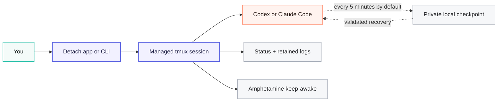

<p align="center">
  
</p>

<h1 align="center">Detach</h1>

<p align="center">
  <strong>Close the terminal. Keep the agent running.</strong><br>
  The macOS reliability layer for long-running Codex and Claude Code sessions.
</p>

<p align="center">
  Leave, monitor, and recover agent sessions from one native app—with private,
  local recovery checkpoints every five minutes by default.
</p>

<p align="center">
  <a href="https://github.com/iltsarev/detach/releases/latest"></a>
  
  
  
</p>

<p align="center">
  <a href="https://github.com/iltsarev/detach/releases/latest"><strong>Download the latest DMG →</strong></a>
  &nbsp;·&nbsp;
  <a href="#quick-start">Quick start</a>
  &nbsp;·&nbsp;
  <a href="#attach-resume-or-recover">How recovery works</a>
  &nbsp;·&nbsp;
  <a href="#prefer-the-terminal-the-cli-is-first-class">CLI</a>
</p>

<p align="center">
  <sub>Apple silicon + Intel · Native app + CLI · No separate Detach account · Recovery state stays on your Mac</sub>
</p>

---

## Long agent runs without terminal babysitting

Long refactors, migrations, and test-and-fix loops are useful only if you can
leave them. Detach turns Codex or Claude Code runs launched through it into
managed sessions with a stable home and a clear way back.

- **Leave it running.** Close the terminal window or quit Detach.app. The live
  process continues in tmux while the Mac is running, and required keep-awake
  integration can keep it going with the lid closed.
- **Know when to come back.** See what is running, waiting for your next
  message, finished, failed, or recoverable. Inspect logs, model, context use,
  and the latest checkpoint; optionally get notified when a turn completes or
  a session finishes, fails, or becomes recoverable.
- **Return without guessing.** Attach to the live process, resume an existing
  provider conversation, or recover an interrupted managed run with explicit,
  provider-specific safeguards.
- **Use one workflow for both agents.** Codex and Claude Code share the same
  dashboard, session list, controls, project protection, and universal
  UUID-based resume command.

> tmux keeps the process alive while the Mac is running. Detach adds a recovery
> layer for the conversation: it tracks provider identity, saves validated
> local checkpoints, retains logs, coordinates keep-awake, and applies
> explicit recovery rules.

Detach ships as a Mac product, not a setup recipe: one DMG includes guided
setup, dependency diagnostics, a bundled CLI, repair, updates, and a background
watchdog. You keep working in the provider and terminal you already use.
Detach.app is available in English and Russian and follows the language chosen
for Detach in macOS.

## Quick start

> [!IMPORTANT]
> Before the first run, meet the [requirements](#requirements) below. Guided
> setup checks installed executables and required Mac components, then offers a
> concrete next step for anything missing. Provider authentication remains in
> Codex or Claude Code itself.

1. Download the current **DMG** from
   [GitHub Releases](https://github.com/iltsarev/detach/releases/latest), move
   **Detach.app** to `/Applications`, and open it.
2. Follow guided setup. Detach installs its bundled CLI, registers its required
   background service, and checks the rest of the runtime. When Amphetamine or
   Power Protect is missing, setup opens its official App Store or project page.
3. If needed, install [Codex CLI](https://github.com/openai/codex) or
   [Claude Code](https://docs.anthropic.com/en/docs/claude-code/overview), then
   return to Detach and recheck. Detach verifies that the CLI is present;
   authenticate through the provider's normal flow before the first run.
4. Choose **＋**, select a project and provider, add an optional opening prompt,
   and start the session.

When the session appears as running in the sidebar, you are done. Close the
terminal window or Detach.app and the managed worker and checkpoints continue;
reopen Detach whenever you want the dashboard back.

Prefer to start from a shell? Guided setup also adds `detach` to your login and
interactive shell. Open a new terminal window, then run:

```bash
cd ~/my/repo
detach codex
# or
detach claude
```

## One command center for every session

Detach.app is the control plane for your agents, not another embedded chat UI.
Interactive work opens in a compatible terminal you choose; the app gives the
entire lifecycle of every managed session one clear home:

- **Start:** choose a project, Codex or Claude Code, and an optional first
  prompt.
- **Monitor:** see both providers in one sidebar with live status, model and
  context usage when available, checkpoint time, and ANSI-aware log previews.
- **Know:** opt in to notifications when a completed turn is waiting for your
  next message, or when a session finishes, fails, or becomes recoverable.
- **Rejoin:** open a live session, resume a known provider conversation, or
  recover an interrupted managed run in your selected terminal.
- **Maintain:** inspect setup health, repair the CLI, manage updates, and remove
  Detach-owned components from Settings.

The main app window is not the runtime. A managed session and its checkpoint
loop continue independently, and the dashboard catches up when you reopen it.
Turn-ready status is derived from structured provider lifecycle records rather
than terminal-text guesses; mid-turn permission prompts are not covered by
that signal.

## Attach, resume, or recover?

Detach keeps three return paths deliberately separate:

| Situation | Action | What happens |
|---|---|---|
| The managed worker is still alive | **Attach** | Reopen the existing tmux session without starting another agent. |
| The provider conversation already exists | **Resume** | Continue it by UUID; Detach finds the provider and saved project and can repair matching missing or damaged artifacts when a checkpoint safely helps. |
| A Detach-managed run was interrupted | **Recover** | Restart from Detach's saved session context and apply the provider's conservative checkpoint-recovery policy before resuming. |

In short: **Attach = live process**, **Resume = provider conversation**,
**Recover = interrupted managed run**.

Recovery is conservative and provider-specific. It validates session identity,
paths, and contents before deciding whether a matching checkpoint should
repair or replace provider state. The exact policies are documented below.

A saved point can be older than the default five-minute interval if a snapshot
could not complete. Checkpoints protect the agent conversation—not repository
contents. Detach records Git worktree status for diagnosis but never rolls
project files back.

## How Detach keeps a session durable



Each agent runs under a managed tmux worker, so closing a client does not kill
the process. Once provider identity is available, Detach attempts an initial
checkpoint, repeats every five minutes by default, and attempts a final
checkpoint when the worker exits. It also retains terminal output and session
status after the provider process finishes.

Checkpoints stay on your Mac with private file permissions. Detach has no
separate account or hosted session backend; Codex or Claude Code continues to
use its own normal service and local session storage.

## Recovery with guardrails

- **Provider-aware:** Detach saves the actual conversation format and companion
  state each provider needs, instead of treating every agent as a generic
  terminal process.
- **Validated:** session IDs, JSONL contents, archive paths, and destinations
  are checked before recovery writes into provider storage.
- **Project-safe:** recovery never changes repository files, and a shared
  project lock prevents two Detach-managed agents from racing over the same Git
  worktree—even across different providers.
- **Ownership-safe:** attach, stop, and delete refuse to operate on a tmux
  session Detach does not own.
- **Private by default:** checkpoint metadata, logs, and conversation data are
  local and created with private permissions.
- **Update-safe:** CLI payloads are immutable and activated atomically, so an
  app or CLI update does not rewrite the bytes used by agents already running.

<details>
<summary><strong>Provider recovery policies and checkpoint contents</strong></summary>

Recovery behavior differs where the provider formats differ:

- **Claude Code:** explicit recovery restores a valid matching checkpoint and
  its companion artifacts when one is available, then resumes the conversation.
- **Codex:** recovery preserves a valid live rollout when its file is at least
  as large as the checkpoint. It restores only when the matching live rollout
  is missing, invalid, or smaller.
- **Both:** normal resume may repair missing or damaged matching session data
  before continuing; unsafe paths, mismatched session IDs, and invalid
  checkpoint contents are rejected.

A successful conversation checkpoint publishes metadata and valid provider
session state. Detach also attempts to capture terminal output and Git
worktree status, plus provider-specific supporting state when available:

- **Codex:** session UUID and rollout JSONL. A separate best-effort SQLite
  backup is published only after an integrity check succeeds; it is an
  emergency artifact and is never restored over Codex's shared database
  automatically.
- **Claude Code:** preassigned session UUID, transcript JSONL, project companion
  data, file history, session environment, tasks, and matching team data,
  packed atomically into an archive.

Change the interval for special cases:

```bash
DETACH_CODEX_CHECKPOINT_INTERVAL=600 detach codex
DETACH_CLAUDE_CHECKPOINT_INTERVAL=600 detach claude
```

Checkpoint directories contain full conversation data:

```text
~/.local/state/detach/codex/sessions/
~/.local/state/detach/claude/sessions/
```

`delete` removes the selected Detach session state. Uninstall with
`--keep-state` preserves checkpoints; `--purge-state` removes Detach state.
None of these commands remove transcripts from `~/.codex` or `~/.claude`.

</details>

## Prefer the terminal? The CLI is first-class

The app installs `detach` and configures it for your login and interactive
shell. Start a foreground session, send a first prompt, run immediately in the
background, or return by UUID without remembering which provider or project it
belonged to:

```bash
detach codex
detach codex -- "implement the queued task"
detach claude --detach -- "run the test suite and fix failures"

detach list
detach resume SESSION_UUID
```

<details>
<summary><strong>CLI commands and named sessions</strong></summary>

Name a session when you want something more memorable than the project-derived
default:

```bash
detach claude --name migration
detach claude attach migration
detach claude logs migration
detach claude stop migration
```

List every Detach-managed session across both providers, then resume by UUID:

```bash
detach list
detach resume SESSION_UUID
detach resume --name migration --detach SESSION_UUID
```

| Command | What it does |
|---|---|
| `detach <provider> [start]` | Start a fresh session for the current project (Git root when available). |
| `detach <provider> attach [name]` | Attach to a session that is still running. |
| `detach list [--json]` | List Codex and Claude sessions together; JSON mode emits JSONL. |
| `detach resume <uuid>` | Detect the provider and project, then continue that provider conversation. |
| `detach <provider> status [name]` | Show worker, provider, checkpoint, and keep-awake state. |
| `detach <provider> logs [name]` | Read the retained tmux pane without attaching. |
| `detach <provider> stop [name]` | Stop a running managed session. |
| `detach <provider> recover [name]` | Restart an interrupted managed run using its saved recovery context. |
| `detach <provider> delete [name]` | Delete stopped Detach state; leave provider storage untouched. |
| `detach doctor` | Check installation integrity, dependencies, providers, Amphetamine, Power Protect, and the background service. |

A normal start always creates a new Codex or Claude conversation. Use `attach`
for a live worker and `resume` for an existing provider conversation. Detach
allows one live managed agent per project across both providers, so two agents
cannot race over the same worktree by accident.

Closing the terminal window only detaches its tmux client. Press `Ctrl-b d` to
detach without closing the window.

</details>

## Close the lid without abandoning the run

Keep-awake protection turns on automatically for every managed session. Detach
requires [Amphetamine](https://apps.apple.com/app/amphetamine/id937984704), its
official [Power Protect component](https://x74353.github.io/Amphetamine-Power-Protect/),
and the Detach background service. Guided setup remains open until all three
are ready, and macOS may request the required background and Automation
permissions.

> [!CAUTION]
> Closed-lid sessions may cool less effectively during sustained CPU load, and
> excess heat is easier to miss. Keep the Mac on a hard, flat, well-ventilated
> surface—never on bedding, in a sleeve, or inside a bag—and keep every vent
> clear. Check it periodically; open the lid or stop the session if it becomes
> unusually hot or shows a temperature warning. See
> [Apple's temperature guidance](https://support.apple.com/en-us/102336).

<details>
<summary><strong>How keep-awake coordination stays safe</strong></summary>

The first live session acquires one compatible closed-lid Amphetamine session.
If you already started a compatible session, Detach borrows it; otherwise it
starts one. Additional Detach sessions share the same lease. The last session
ends it only if Detach created it and its observable properties have not
changed. A borrowed user session is never replaced or ended.

The required per-user helper reconciles stale leases after crashes and at
login. If Amphetamine's low-battery auto-end setting is enabled, Detach honors
its configured threshold and will not start a new closed-lid task at or below
it. Detach warns when that protection is disabled; it does not change the
setting for you.

Do not replace the Amphetamine session manually while Detach sessions are
running. Closed-lid coordination is currently single-user; multiple
simultaneously logged-in users are not supported.

</details>

<details>
<summary><strong>Security defaults and provider flags</strong></summary>

### Codex

On an unmanaged Mac, Detach defaults to:

```text
--ask-for-approval never --sandbox workspace-write --no-alt-screen
```

This lets the agent work autonomously inside the repository without granting
unrestricted system access. Explicit Codex approval and sandbox arguments
override the defaults. When managed requirements disallow `never`, Detach
inherits the configured managed approval policy and reviewer instead. Detach
owns `-C/--cd`; start it from the target project.

### Claude Code

Detach defaults to `--permission-mode auto` unless you pass an explicit mode.
It never adds `--dangerously-skip-permissions` on its own. Detach owns provider
session and background flags such as `--session-id`, `--resume`, and
`--background` so checkpoint identity and tmux lifetime stay deterministic.
Provider flags that collide with Detach flags, such as Claude's own `--name`,
belong after `--`.

Both providers run without the alternate screen so retained logs and terminal
checkpoints stay readable.

</details>

<details>
<summary><strong>Repair or remove installed components</strong></summary>

Installation, updates, repair, and removal of Detach-owned CLI and helper
components are available in Detach.app. If you are troubleshooting from a
terminal, check or repair the installed CLI:

```bash
detach doctor
detach repair
detach uninstall --keep-state
```

Prefer uninstalling from Detach Settings so macOS can unregister the required
background helper before removing the CLI. Keeping state preserves recovery
checkpoints for a future reinstall. Uninstall also removes the shell PATH entry
that Detach owns, without removing a PATH entry you created yourself.

To remove Detach checkpoints as well:

```bash
detach uninstall --purge-state
```

This requires an explicit request and still leaves Codex and Claude local
storage, Amphetamine Power Protect, and system configuration alone. Uninstall
refuses to run while a managed session is alive. Detach.app itself remains
until you move it to Trash.

</details>

## Requirements

| Component | Requirement |
|---|---|
| Mac | macOS 14 or newer; Apple silicon and Intel are supported |
| Codex CLI or Claude Code | At least one provider installed and authenticated |
| `tmux` and `jq` | Required; guided setup checks both and offers a ready next step when missing |
| Amphetamine + Power Protect | Required for automatic keep-awake and closed-lid coordination |
| Detach background service | Required for keep-awake reconciliation after crashes and login |

## Start the next long run in Detach

Make the terminal a view into the work—not the thing keeping it alive.

[**Download the latest DMG →**](https://github.com/iltsarev/detach/releases/latest)
&nbsp;·&nbsp;
[Report an issue](https://github.com/iltsarev/detach/issues)
