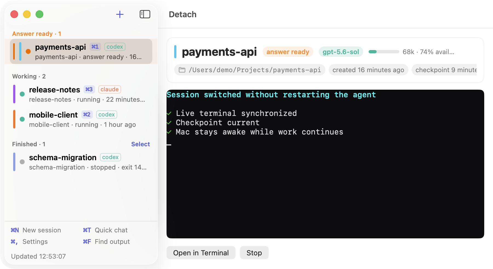
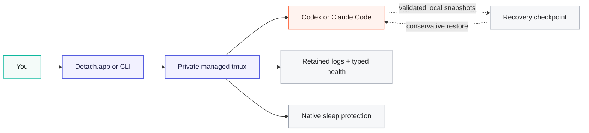

<p align="center">
  
</p>

<h1 align="center">Detach</h1>

<p align="center">
  <strong>Close the window. Keep the agent running.</strong><br>
  The native macOS control center for persistent Codex and Claude Code sessions.
</p>

<p align="center">
  <a href="https://github.com/iltsarev/detach/releases/latest"></a>
  
  
  
  
</p>

<p align="center">
  <a href="https://github.com/iltsarev/detach/releases/latest/download/Detach.dmg"><strong>Download Detach.dmg →</strong></a>
  &nbsp;·&nbsp;
  <a href="#why-detach">Why Detach</a>
  &nbsp;·&nbsp;
  <a href="#command-line-reference">CLI reference</a>
</p>

<p align="center">
  
</p>

Detach gives long-running coding agents a durable place to work. Start a run,
use the built-in terminal, close the app, and return when the agent needs you.
Detach keeps the process, health state, checkpoints, logs, and Mac power policy
together.

## Why Detach

Codex and Claude Code can work for minutes or hours. A terminal window should
not be the weak link.

- **Leave without ending the run.** Close Terminal, close the Detach window, or
  detach from tmux. The managed agent continues in the background.
- **Run everything in one native app.** Start Codex or Claude Code, type in the
  interactive terminal, paste text or images, search output, and reconnect a
  terminal client without restarting the agent.
- **See what needs you now.** Sessions that wait for a reply move into
  **Answer ready**. Notifications and the menu bar show when a turn finishes,
  fails, or becomes recoverable.
- **Get changes without a refresh delay.** Native filesystem events wake the
  dashboard when lifecycle or provider turn data changes. Detach does not run
  a repeating session-list timer while nothing changes.
- **Return the correct way.** Attach to a live process, Resume a provider
  conversation, or Recover an interrupted Detach run from a validated local
  checkpoint.
- **Let the Mac keep working safely.** Two-layer sleep protection can keep an
  active run working with the lid closed. It releases protection while all
  agents wait, and it fails safe for low battery or high temperature.
- **Keep control of local data.** Checkpoints and retained logs stay on your
  Mac. Detach shows their size and removes only state that it proves is safe to
  delete.

Detach does not replace Codex or Claude Code. It adds process ownership,
interactive access, recovery, power protection, and operations around them.

## Download and install

1. [**Download Detach.dmg**](https://github.com/iltsarev/detach/releases/latest/download/Detach.dmg).
2. Open the DMG and drag **Detach.app** to **Applications**.
3. Open **Detach** and complete the guided setup.

That is the complete Detach installation. You do not need Homebrew, a separate
tmux or JSON tool, `caffeinate`, or another keep-awake app.

Detach manages provider CLIs; it does not install or replace them. Install and
authenticate at least one supported provider first:

- [Codex CLI](https://github.com/openai/codex)
- [Claude Code](https://docs.anthropic.com/en/docs/claude-code/overview)

> [!IMPORTANT]
> Detach is a Mac app. Install it from the DMG in Finder. Do not give this
> repository link to an agent and ask the agent to install it.

<details>
<summary><strong>What guided setup does</strong></summary>

The setup assistant installs the bundled `detach` CLI, checks every component,
and explains the one-time macOS approvals for the background monitor and the
sleep-protection helper. A pending approval is an actionable setup step, not an
installation failure. Setup completes after the signed helper is reachable and
the background monitor reports.

The assistant detects Codex CLI and Claude Code separately. It explains which
provider is missing or not authenticated without mixing provider setup with the
Detach installation.

</details>

## From prompt to finished work

1. Click **＋**. Choose a project, provider, and optional session name.
2. Expand **Advanced** if you want to add an initial prompt. Click **Start**.
3. Work in the embedded terminal or leave Detach while the agent works.
4. Return to answer the agent, inspect progress, stop the run, Resume a
   conversation, or Recover an interrupted run.

The app and CLI control the same sessions. Start in one and continue in the
other.

```bash
cd ~/my/repo
detach codex -- "implement the queued task"

# Use Claude Code and return immediately to the shell.
detach claude --detach -- "run the test suite and fix failures"
```

The embedded terminal keeps the shortcuts that matter:

| Action | Control |
|---|---|
| Open the standard New session sheet | `Cmd-N` |
| Start a Quick chat immediately | `Cmd-T` |
| Switch to a numbered Working or Answer ready session | `Cmd-1` … `Cmd-9` |
| Paste text | `Cmd-V` |
| Give Codex or Claude Code an image from the clipboard | `Ctrl-V` |
| Find terminal output | `Cmd-F` |
| Replace an exited terminal client without restarting the agent | **Reconnect** |

Settings → General selects the provider and parent folder for Quick chat. The
default is `/tmp`. Each `Cmd-T` creates a private
`detach-chat-<uuid>` project inside that folder, so another Quick chat can
start while earlier chats are still running. The same settings page selects
the default folder for the standard project chooser. Quick chat uses the
normal managed session lifecycle. Detach does not automatically delete its
project files, state, or provider transcripts.

Detach shows each assigned session shortcut beside its name. The number stays
with the session while it is in Working or Answer ready. Detach reuses the
number after the session leaves both sections. If more than nine sessions are
eligible, each extra session waits for the first free number.

Start, Resume, and Recover run inside Detach and do not require an outer
terminal. The selected external terminal remains available as a fallback for
Attach, Resume, and Recover.

The live terminal processes PTY input and output as events. Its on-demand GPU
renderer repaints only when content changes. A steady cursor avoids an idle
redraw timer. If Metal is unavailable, Detach keeps the CoreGraphics renderer.

The dashboard also updates from events. Detach coalesces a provider transcript
burst into one update at the start and one after output becomes quiet. Each
event reads a complete typed session list. A dropped event or app activation
causes a full resync. There is no Refresh interval setting and no periodic
session-list process while state is idle.

<details>
<summary><strong>How a new in-app session starts</strong></summary>

Detach runs the CLI with `--detach` in the selected project. It waits for the
event-driven typed session source. When one new matching `starting` session
appears, Detach selects it and opens the embedded terminal before the full
readiness check ends. A start error stays in the sheet so that you can correct
it. Terminal, iTerm2, Warp, or another configured shell runner remains
available from the named fallback button.

</details>

## One control center for every run

Codex and Claude Code share one dashboard. Each managed session includes:

- live working, waiting, completed, failed, hung, recoverable, orphaned, and
  stopped state;
- an explicit health reason when the runtime needs attention;
- provider, project, model, context use, checkpoint time, and exit status;
- an interactive terminal for a live session and ANSI-aware retained logs for
  session history;
- safe **Attach**, **Stop**, **Resume**, **Recover**, and **Delete** actions
  selected from the proven session state;
- checkboxes in **Finished** for one-confirmation deletion of eligible
  sessions; a failed deletion does not stop the remaining deletions;
- optional notifications for an answer, completion, failure, or recovery;
- one stable identity color in the sidebar and the tmux status bar. Current
  Codex and Claude tasks avoid colors that are already in use.

A compact guide below the session list keeps `Cmd-N`, `Cmd-T`, `Cmd-,`, and
`Cmd-F` visible without opening a help screen.

Sessions that wait for your reply move into **Answer ready**, before agents
that are still working. Detach reads structured provider lifecycle records for
this signal. It does not guess from terminal text. Mid-turn permission prompts
are not currently part of the signal.

The optional menu bar companion shows:

- whether the Mac can sleep;
- whether the background health report is fresh;
- how many sessions hold power protection;
- which sessions wait for an answer.

The menu bar dot is green while an agent works and orange while at least one
session waits for you. Closing the main window keeps the menu bar and background
checks available. Quitting Detach.app does not kill managed sessions.

## Attach, Resume, and Recover

These actions solve different problems:

| Situation | Action | What Detach does |
|---|---|---|
| The managed worker is still alive | **Attach** | Open a client for the existing tmux session. Do not start another agent. |
| The provider conversation exists | **Resume** | Continue the conversation by UUID in its saved project. |
| A Detach-managed run was interrupted | **Recover** | Validate saved context and a checkpoint, then restart the exact conversation under Detach. |

**Attach = live process. Resume = provider conversation. Recover = interrupted
managed run.**

Recovery validates identity, paths, and provider data before it writes. It
never rolls repository files back. A shared project lock also prevents two
Detach-managed agents, including agents from different providers, from writing
the same worktree at the same time.

## Reliability that distinguishes slow from broken

Detach owns a private Apple Silicon tmux runtime. Each agent runs on a private,
absolute socket. Closing a client does not kill the worker. Unmounting one
project does not affect sessions for other projects.


```mermaid
flowchart LR
    U["You"] --> D["Detach.app or CLI"]
    D --> T["Private managed tmux"]
    T --> P["Codex or Claude Code"]
    T --> L["Retained logs + typed health"]
    T --> A["Native sleep protection"]
    P -. "validated local snapshots" .-> C["Recovery checkpoint"]
    C -. "conservative restore" .-> P

    classDef user fill:#F4FBF9,stroke:#0DB89E,color:#18211F;
    classDef detach fill:#F2F1FF,stroke:#545CE0,color:#202145,stroke-width:2px;
    classDef provider fill:#FFF3EF,stroke:#FF734D,color:#2B1D19;
    classDef state fill:#F6F7F9,stroke:#9CA3AF,color:#202124;
    class U user;
    class D,T detach;
    class P provider;
    class L,A,C state;
```

Detach evaluates health from independent facts:

- the expected tmux server, managed session, and retained pane;
- the Detach ownership marker and per-run token;
- the exact worker PID and provider PID, user ownership, and process relation;
- valid metadata and provider conversation identity;
- worker heartbeat and checkpoint freshness;
- a checkpoint that is valid enough for conservative recovery.

| State | Meaning | Safe actions |
|---|---|---|
| **Running** | The pane, worker, provider, and run token agree. | Attach, Stop |
| **Hung** | A required runtime identity is missing or inconsistent, or a recorded process survived tmux. | Attach or Stop only when tmux ownership is proven. Otherwise, no mutation. |
| **Recoverable** | The live runtime is gone and a matching validated checkpoint exists. | Recover, Delete |
| **Orphaned** | The live runtime is gone and no safe recovery checkpoint exists. | Delete |
| **Finished / stopped** | The worker reached a terminal state. | Resume or Delete, according to provider identity. |
| **Collision / corrupt** | tmux ownership or metadata cannot be trusted. | Conservative, state-specific actions only. |

A stale heartbeat or old checkpoint is diagnostic information. It does not
prove that an agent is hung. If the owned worker and provider are alive, Detach
keeps the session running through a long provider turn.

If tmux disappears while a recorded process is still alive, Detach blocks
Stop, Recover, Delete, and bulk cleanup until that exact runtime is gone. It
never signals or removes foreign processes and unmanaged tmux sessions.
Concurrent Stop, Recover, and Delete requests are serialized per session and
recheck ownership immediately before mutation.

<details>
<summary><strong>Checkpoint and recovery rules</strong></summary>

After Detach knows the provider identity, it attempts an initial conversation
checkpoint. By default, it repeats the checkpoint every five minutes and makes
a final attempt when the worker exits. Detach also retains terminal output and
records canonical repository context without invoking Git or the Apple Command
Line Tools shim.

When Codex starts a fresh conversation in the same run, for example with
`/clear`, Detach follows the new conversation. Status and later checkpoints
then refer to the conversation that is in use.

- **Codex:** Detach saves the session UUID and rollout JSONL. It keeps a valid
  live rollout when that file is at least as large as the checkpoint. It
  restores only when the matching live rollout is missing, invalid, or smaller.
  A separately validated SQLite backup is an emergency artifact. Detach never
  restores it over the shared Codex database automatically.
- **Claude Code:** Detach saves the preassigned session UUID, transcript,
  project companion data, file history, session environment, tasks, and
  matching team data in one atomic archive. Explicit recovery restores a valid,
  matching checkpoint and its companion artifacts before resume.
- **Both:** Detach rejects unsafe paths, ambiguous or mismatched UUIDs,
  malformed JSONL, and invalid checkpoint contents.

Checkpoint state lives here:

```text
~/.local/state/detach/codex/sessions/
~/.local/state/detach/claude/sessions/
```

Change the default checkpoint interval for a special run:

```bash
DETACH_CODEX_CHECKPOINT_INTERVAL=600 detach codex
DETACH_CLAUDE_CHECKPOINT_INTERVAL=600 detach claude
```

The Detach app is not the runtime. A session, its checkpoint loop, and its
power protection continue independently. The dashboard reads the latest state
when you open it again.

</details>

## Closed-lid work with fail-safe limits

Keep-awake protection starts automatically with a managed session. An
unprivileged wrapper holds the normal IOKit idle-sleep assertion. A narrowly
scoped signed helper manages closed-lid protection. Detach starts the provider
only after it confirms both layers.

When an agent finishes a turn and waits for your reply, that session releases
both Detach protection layers. The provider, tmux session, and checkpoints stay
available. A new turn acquires both layers again. The Mac can sleep only when
every live session waits. Missing or invalid lifecycle state keeps protection
active.

The app, menu bar, CLI, and tmux status bar use the same state:

- **Mac stays awake**
- **Mac can sleep**
- **Mac can sleep: low battery**
- **Mac can sleep: temperature**
- an honest unknown state when the helper or health report cannot be trusted

At 10% battery or lower while on battery power, Detach releases its sleep
assertions. At a public macOS thermal state of `serious` or `critical`, it
immediately releases both layers that it owns and refuses new protected runs.
The provider can continue only while macOS keeps the machine awake. Protection
can return after the state is `nominal` or `fair` for 30 seconds. Detach sends
one warning for each hot interval when session notifications are enabled.

When the lid closes during a protected run, Detach asks macOS to turn off the
display through the normal Lock Screen path. Reopening the lid returns to your
existing Touch ID, Apple Watch, or password policy. Detach does not weaken the
lock policy.

> [!CAUTION]
> Long closed-lid work can hide excess heat. Keep the Mac on a hard, flat, and
> well-ventilated surface. Never put it in a sleeve, bag, or on bedding. Thermal
> safety permits sleep, but it cannot cool a blocked Mac or disable another
> tool's sleep setting. See [Apple's temperature guidance](https://support.apple.com/en-us/102336).

<details>
<summary><strong>Power safety boundary</strong></summary>

Each working session has a renewable root-helper lease. The wrapper renews it
every 30 seconds. A lease expires after 120 seconds without a heartbeat. A
waiting session releases its lease immediately. The last working lease restores
normal closed-lid sleep. An orderly stop also releases the lease immediately.
The TTL limits stale protection after a crash or `SIGKILL`.

Detach records ownership before power changes. If closed-lid protection is
already active, Detach borrows it and never disables it. If Detach enabled the
setting, it restores it after the last lease, a stale lease, or an orderly
helper shutdown. Detach discards leases from an earlier macOS boot session.

The helper accepts requests only from signed Detach power clients with the same
Team ID and from the current non-root console user. It provides only status and
lease operations. It cannot run providers or arbitrary root commands.

Closed-lid protection uses `/usr/bin/pmset -a disablesleep`, an undocumented
macOS interface. Each production release therefore requires a signed real-power
smoke test and a supervised physical lid test on Apple Silicon.

</details>

## Local data, visible and controlled

Checkpoints, metadata, and retained logs stay local with private file
permissions. Detach has no account and no hosted session backend. Codex and
Claude Code continue to use their normal services and local provider storage.
Detach checks tmux ownership and run tokens before Attach, Stop, Recover, or
Delete. It leaves foreign sessions unchanged.

Settings → System shows total Detach disk use, checkpoint and log sizes, and
the largest sessions. You can select safe sessions, preview their exact
allocated size and contents, delete all safely removable sessions, or open the
state directory in Finder.

Cleanup is deliberately narrow:

- only fully measured `stopped` or `orphaned` sessions are eligible;
- a missing cleanup authorization is never inferred from displayed status;
- live, recoverable, corrupt, foreign, or ownership-ambiguous state is not
  eligible;
- provider storage under `~/.codex` and `~/.claude` is excluded;
- symlinks are measured as links and are never followed;
- sparse files, hard links, unreadable entries, and partial deletion are
  handled conservatively;
- the preview is rechecked under the session and checkpoint locks before
  deletion.

Deleting Detach state does not delete provider transcripts or conversations.

```bash
detach storage --json
detach storage cleanup --dry-run --json
detach storage cleanup --dry-run --json --session detach-codex-my-project
```

## Command-line reference

Guided setup adds `detach` to login and interactive shells. Open a new terminal
window after setup.

```bash
# Start.
detach codex
detach codex --detach -- "run the migration"
detach claude --name "Rev (ai)" -- "review the repository"

# Monitor and return.
detach list
detach list --json
detach watch --json
detach claude attach review
detach resume SESSION_UUID

# Diagnose and maintain.
detach doctor
detach storage --json
detach reconcile --dry-run --json
```

| Command | What it does |
|---|---|
| `detach <provider> [start]` | Start a fresh conversation for the current project. |
| `detach <provider> attach [name]` | Attach to a live managed session. |
| `detach list [--json]` | List Codex and Claude sessions together. JSON mode emits JSONL. |
| `detach watch --json` | Stream typed `ready`, `changed`, and `resync` hints for session consumers. Read `list --json` after each hint. |
| `detach resume <uuid>` | Detect the provider and project, then continue the conversation. An owned Claude session without a transcript restarts with the same UUID. |
| `detach <provider> status [name]` | Show runtime, checkpoint, and power state. |
| `detach <provider> logs [--ansi] [name]` | Read retained output without attaching. |
| `detach <provider> stop [name]` | Stop a live session only when its managed runtime is proven. |
| `detach <provider> recover [name]` | Restart an interrupted run from validated saved context. |
| `detach <provider> delete [--force] [name]` | Delete eligible Detach state. Leave provider storage unchanged. |
| `detach storage --json` | Report logical and allocated storage by session and data type. |
| `detach storage cleanup --dry-run --json [--session name]` | Preview an exact safe cleanup selection. |
| `detach reconcile --dry-run --json` | Preview safe stale-state and dead-runtime reconciliation. |
| `detach cleanup --dry-run --json` | Preview bulk cleanup of stopped or orphaned sessions. |
| `detach power status --json` | Read combined idle-sleep and closed-lid protection. |
| `detach config tmux-style [detach\|inherit]` | Use the Detach identity bar or your tmux theme. |
| `detach config tmux-mouse [on\|off]` | Toggle managed scrolling, selection, and copy-mode type-through. |
| `detach config tmux-extended-keys [on\|off]` | Toggle Shift+Return multiline input in managed sessions. |
| `detach doctor [--json]` | Verify the app-installed runtime, provider CLIs, helper, and monitor. |
| `detach repair` | Reinstall the pristine immutable CLI payload from Detach.app. |
| `detach uninstall [--keep-state\|--purge-state]` | Remove Detach components and choose whether checkpoints stay. |

For automation and diagnosis:

```bash
detach list --json
detach watch --json
detach reconcile --dry-run --json
detach cleanup --dry-run --json
```

The reconcile preview includes only declarative repairs that current evidence
supports. The cleanup preview includes only stopped or orphaned sessions whose
typed health result permits cleanup and whose storage and ownership checks pass.

<details>
<summary><strong>Session names and retained history</strong></summary>

In the app, set the optional **Name** field. In the CLI, pass
`--name "Rev (ai)"`. Names can contain spaces, parentheses, Cyrillic, emoji,
and other printable text, up to 100 UTF-8 bytes. Detach stores the label
separately and derives a safe internal tmux and state identifier.

The `SESSION` column and `session_name` JSON field contain the internal
identifier. `NAME` and `display_name` contain the human label. Existing safe
names such as `review` keep their `detach-<provider>-review` identifier. Press
`Ctrl-b d` to detach a terminal client without closing its window.

Project-derived sessions keep separate history for each fresh run. The first
run uses the project-derived identifier. Later runs receive a short increasing
suffix. A new start is refused while a run is live. Attach to the run or stop
it before you start another conversation.

After a run finishes, stops, or becomes safely orphaned, the next default start
creates a new history. It does not replace old metadata, logs, or checkpoints.
Commands without a name select the live or newest history. Use the
`session_name` from `detach list` to select an older history. Typed storage
cleanup can remove eligible histories.

</details>

<details>
<summary><strong>Terminal behavior and appearance</strong></summary>

Each session receives a deterministic provider-and-project color. The app uses
it in the sidebar, and the tmux bar uses the same tint with provider, project,
state, and power labels. Completed sessions fade, and failed sessions turn red.
A new or resumed current task selects another palette color when its preferred
color is in use. Finished history keeps its displayed color but releases that
palette slot. Detach never edits the global tmux configuration.

Shells in user-created split panes close normally on `Ctrl-D` or exit. Only the
managed Codex or Claude pane is retained after completion so that Detach can
preserve output and exit status.

Inside managed tmux, the mouse wheel scrolls one line at a time. Mouse selection
copies to the macOS clipboard and keeps the highlight and scroll position. When
managed mouse input is on, an ASCII or Cyrillic printable key, Space, Enter, or
Backspace leaves copy mode and sends that key to the live prompt. Arrows, page
navigation, Escape, and control chords keep their copy-mode behavior. Use
`detach config tmux-mouse off` to restore the original copy-mode key tables and
return mouse handling to the terminal emulator. In Terminal.app, Option-drag
also bypasses tmux selection.

Shift+Return inserts a newline in managed sessions by default. It sends the
same stable multiline input as Option+Return. Toggle this behavior in Settings
→ Terminal or with `detach config tmux-extended-keys off`. Option+Return always
inserts a newline. OSC 8 links from agent output remain clickable in outer
terminals that support them.

Choose **My tmux theme** in Settings → Terminal, or run
`detach config tmux-style inherit`, to remove the Detach bar overrides.

</details>

<details>
<summary><strong>Default provider flags</strong></summary>

### Codex

On an unmanaged Mac, Detach defaults to:

```text
--ask-for-approval never --sandbox workspace-write --no-alt-screen
```

Explicit approval and sandbox arguments override these defaults. If managed
requirements disallow `never`, Detach inherits the managed approval policy and
reviewer. Detach owns `-C/--cd`. Start it from the target project.

### Claude Code

Detach defaults to `--permission-mode auto` unless you pass an explicit mode.
It never adds `--dangerously-skip-permissions`. Detach owns provider session
and background flags so that checkpoint identity and tmux lifetime stay
deterministic. Put provider flags that collide with Detach flags after `--`.

Both providers run without the alternate screen so that retained output stays
readable.

</details>

## A self-contained Mac product

| Component | Included behavior |
|---|---|
| Native app | Interactive terminal, dashboard, settings, notifications, menu bar companion, setup, repair, and uninstall. |
| Private tmux | Bundled Apple Silicon runtime with no separate tmux install or global configuration changes. |
| Typed state runtime | Reads and updates Detach JSON and JSONL without a `jq` dependency. |
| Native power components | Idle-sleep assertion, signed closed-lid helper, and background health monitor. |
| Updates | Signed Sparkle updater in Detach.app. |
| CLI | App-installed `detach` command that controls the same sessions as the dashboard. |

Immutable CLI payloads activate atomically. An update does not rewrite bytes
that running sessions use. Provider credentials pass to tmux in memory and are
never written to session startup scratch files.

## Requirements and honest limits

| Component | Requirement |
|---|---|
| Mac | macOS 26 or newer on Apple Silicon (`arm64`). Intel Macs are not supported. |
| Provider | At least one authenticated Codex CLI or Claude Code installation. |
| macOS approval | An administrator password is required once to register the signed power helper. Login Items approval can also be required. |

Detach keeps a live process running while the macOS user session is active and
the Mac is on. Live sessions do not survive logout or reboot. If you kill the
provider, worker, or private tmux server, the live run ends. The last valid
checkpoint can still offer Resume or Recover.

Checkpoints protect provider conversation state, not repository files. Detach
does not roll source code back. It does not replace version control or backups.

## Repair, update, and uninstall

Detach.app handles updates. Settings shows installation health, CLI repair,
helper status, and removal of Detach-owned components.

Detach changes the active CLI only after it validates a complete payload. If an
update fails, the active CLI does not change. A normal app update does not
interrupt live sessions. If a working session holds a power lease, Detach keeps
the current helper and session dashboard. It retries the helper update after
the leases are released and the app becomes active again. Repairing a damaged
active payload can require you to end sessions that use it.

Move Detach to `/Applications` before you update it. For a download failure,
check the network and try again. For an archive, signature, or installation
failure, download the latest DMG. If the CLI does not match the app, open
Settings → System and run Repair.

```bash
detach doctor
detach repair
detach uninstall --keep-state
detach uninstall --purge-state
```

`--keep-state` preserves recovery checkpoints for a future reinstall.
`--purge-state` removes Detach state but leaves `~/.codex` and `~/.claude`
unchanged. Uninstall refuses to continue while a managed session is alive.
Detach.app remains until you move it to Trash.

## Give the next long run a durable home

[**Download Detach.dmg →**](https://github.com/iltsarev/detach/releases/latest/download/Detach.dmg)
&nbsp;·&nbsp;
[Report an issue](https://github.com/iltsarev/detach/issues)
